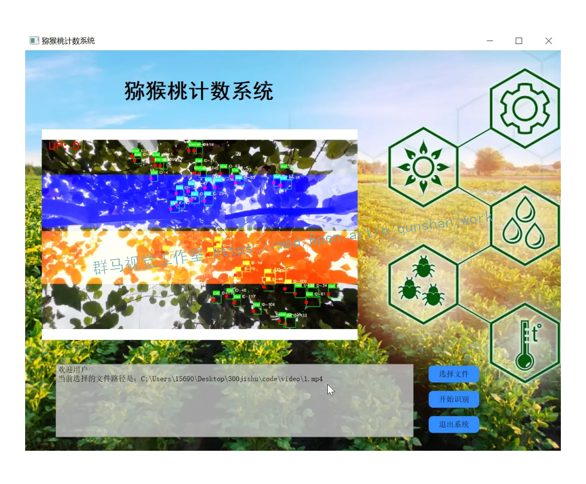
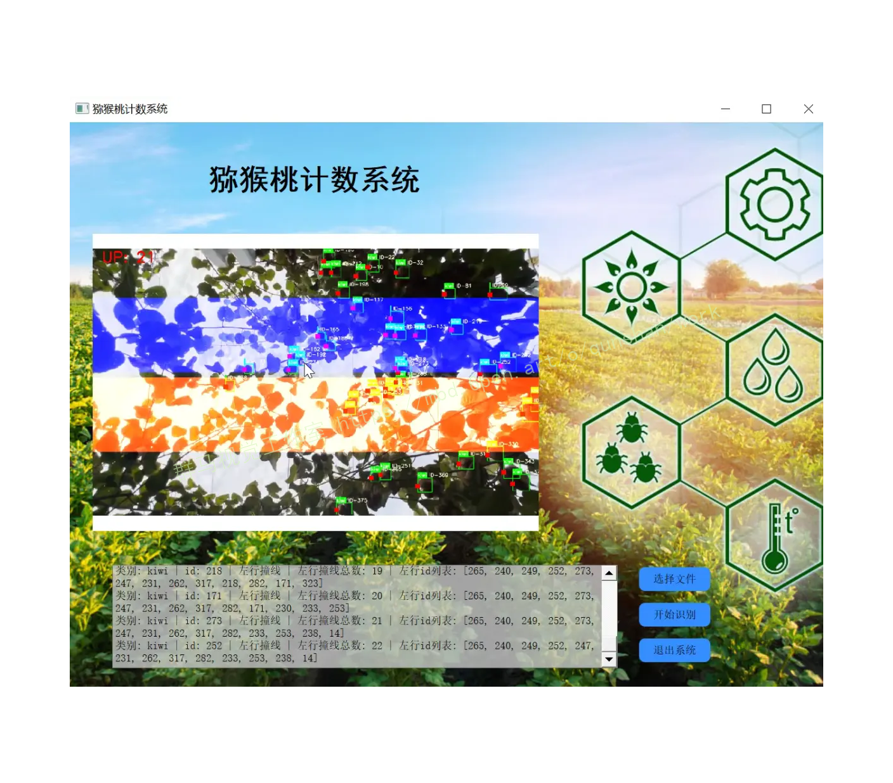
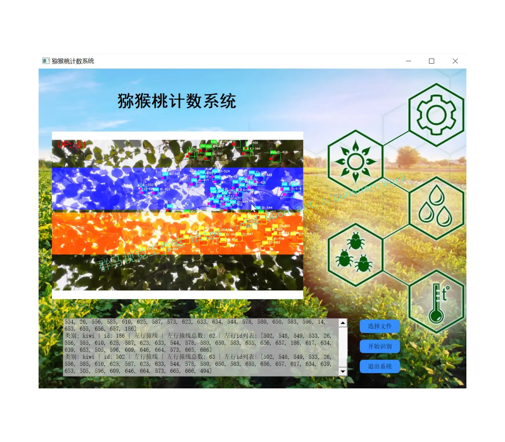
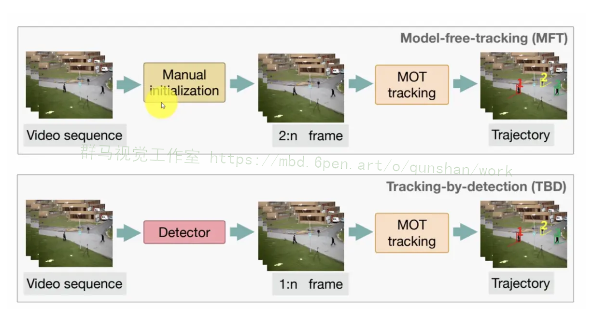
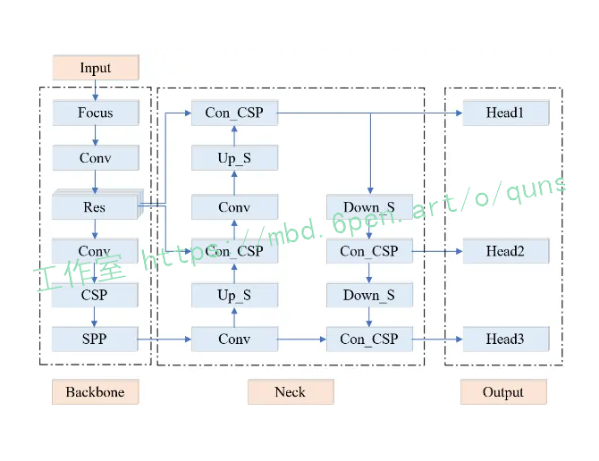
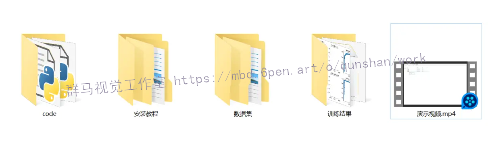


# 1.研究背景与意义


随着人口的不断增长和全球食品需求的增加，农业生产的效率和可持续性变得越来越重要。在农业生产中，果树的种植是一个重要的领域，而猕猴桃是一种受欢迎的水果，具有丰富的营养价值和市场需求。然而，猕猴桃的种植和管理过程中存在一些挑战，其中之一是准确计数猕猴桃的数量。

传统的猕猴桃计数方法主要依赖人工进行，这种方法费时费力且容易出错。因此，开发一种自动化的猕猴桃计数系统对于提高生产效率和减少人力成本具有重要意义。近年来，计算机视觉和深度学习技术的快速发展为解决这一问题提供了新的可能性。

YOLOv5是一种基于深度学习的目标检测算法，它能够实时准确地检测和定位图像中的多个目标。相比于传统的目标检测算法，YOLOv5具有更高的检测速度和更好的准确性。因此，将YOLOv5应用于猕猴桃计数系统中，可以提高计数的准确性和效率。

OpenCV是一个广泛使用的计算机视觉库，它提供了丰富的图像处理和分析功能。通过结合YOLOv5和OpenCV，可以实现对猕猴桃图像的预处理、目标检测和计数等功能。这种综合应用可以帮助农民和果园管理者更好地了解猕猴桃的生长情况，优化农业生产过程。

因此，基于YOLOv5和OpenCV的猕猴桃计数系统具有重要的研究意义和实际应用价值。通过该系统，可以实现对猕猴桃数量的自动化计数，提高计数的准确性和效率，减少人力成本。此外，该系统还可以为果园管理者提供实时的猕猴桃生长情况监测，帮助他们做出更好的决策，提高果树的产量和质量。总之，该研究对于推动农业生产的现代化和可持续发展具有重要意义。

# 2.图片演示






# 3.视频演示

# 4.DeepSort 算法

### 4.1 DeepSort 算法原理
D e e p S o r t 算 法 是 主 要 用 于 进 行 多 目 标 跟 踪（Multiple Object Tracking, MOT）的算法。DeepSort算法是 Sort 算法的改进版本，即在 Sort 算法的基础上增加了级联匹配和状态的确定，从而可以实现对目标进行比较稳定的追踪。DeepSort 算法核心部分为卡尔曼滤波、匈牙利算法 [11]，卡尔曼滤波的主要作用是预测下一帧时目标框所在的新位置，匈牙利算法的主要作用是实现将卡尔曼滤波得到的新目标框与目标检测得到的新预测框进行级联匹配和 IOU 匹配，从而实现对每个目标的追踪，并且每个目标都会有一个对应的 ID 编号。


### 4.2 DeepSort算法结合改进YOLOv5算法
本研究采用DeepSort算法结合改进YOLOv5算法的方式，主要实现改进YOLOv5算法对目标进行检测，而DeepSort算法则对改进YOLOv5算法检测到的结果进行追踪及计数，具体步骤如下。
1)把视频按帧数进行分解后，将每一帧的图像送入YOLOv5算法中对所需要检测的目标进行识别并输出其对应预测框的信息。
2)将该预测框的信息送入DeepSort算法中以实现在原图像中将每个目标裁剪出来，从而提取其表观特征和运动特征。
3)将相邻两帧的目标进行匹配，从而给每个目标一个单独的ID编号。

YOLOv5是目前主流的一阶段目标检测算法，按模型量级可分成YOLOv5s、YOLOv5m、YOLOv51、YOLOv5x。其中，YOLOv5x模型的量级最大，所需要卷积的网络深度最大，速度最慢。基于实际场景需求及配置，最终采用YOLOv5s模型来对柑橘果实进行识别。YOLOv5s主要由输入( Input)、主干(Backbone)、颈部(Neck)和输出(Output)四个部分组成，其结构框图如图1所示。
1)对于输入(Input)部分，其主要是将图片统一调整为640×640三通道格式，并将调整后的图片送入主干(Backbone)部分中。
2)对于主干(Backbone)部分，其主要包括Focus结构、Conv结构、CSP结构、SPP结构和Res结构。Focus结构主要对图片进行了切片操作，从而将通道数扩展了4倍，其可在保证图片信息不丢失的同时提高后续的计算速度。Conv结构主要对图片进行卷积的操作，并结合非线性的激活函数将激活的特征信息引入到更深的网络中，从而提高网络的表达能力。CSP结构主要对图片进行残差卷积的操作，其可以避免在网络加深时出现梯度消失的现象，并且也可以更好地提取目标的特征信息。SPP结构主要通过四个池化核来分别进行池化处理，最后将池化结果进行相加以实现多尺度融合，从而可得到更多尺度的特征信息。而Res结构主要包括Conv结构和CSP结构两个部分，从而实现多次卷积操作。
3)对于颈部(Neck)部分，其主要包括Conv结构、Up_S结构、Down_S结构和Con_CSP结构。Up_S结构主要实现上采样的操作，Down_S结构主要实现下采样的操作，Con_CSP结构主要实现相加与残差卷积相结合的操作。颈部(Neck)部分整体可看作是FPN+PAN结构，其可更为精准地传递目标的特征信息。在FPN结构中，其主要实现将特征信息从高维度向低维度传递;在PAN结构中，其主要实现将特征信息从低维度向高维度传递。所以结合FPN结构与PAN结构就可更清楚地定位大目标与小目标的相关特征[9]。
4)对于输出(Output)部分，其主要分为3个Head结构。Head结构主要通过损失函数与非极大抑制的计数，从而在图片中输出各目标的类别及其置信度得分，同时输出各目标预测边框的对应位置。


# 5.核心代码讲解

#### 5.1 detector_CPU.py
```
class Detector:
    def __init__(self):
        self.img_size = 640
        self.threshold = 0.5
        self.stride = 1

        self.weights = './best.pt'

        self.device = '0' if torch.cuda.is_available() else 'cpu'
        self.device = select_device(self.device)
        model = attempt_load(self.weights, map_location=self.device)
        model.to(self.device).eval()
        model.float()

        self.m = model
        self.names = model.module.names if hasattr(
            model, 'module') else model.names

    def preprocess(self, img):
        img0 = img.copy()
        img = letterbox(img, new_shape=self.img_size)[0]
        img = img[:, :, ::-1].transpose(2, 0, 1)
        img = np.ascontiguousarray(img)
        img = torch.from_numpy(img).to(self.device)
        img = img.float()
        img /= 255.0
        if img.ndimension() == 3:
            img = img.unsqueeze(0)

        return img0, img

    def detect(self, im):
        im0, img = self.preprocess(im)

        pred = self.m(img, augment=False)[0]
        pred = pred.float()
        pred = non_max_suppression(pred, self.threshold, 0.4)

        boxes = []
        for det in pred:
            if det is not None and len(det):
                det[:, :4] = scale_coords(
                    img.shape[2:], det[:, :4], im0.shape).round()

                for *x, conf, cls_id in det:
                    lbl = self.names[int(cls_id)]
                    x1, y1 = int(x[0]), int(x[1])
                    x2, y2 = int(x[2]), int(x[3])

                    xm = x2
                    ym = y2
                    boxes.append((x1, y1, x2, y2, lbl, conf))

        return boxes
```
以上代码将原始代码封装为了一个名为`Detector`的类，其中包含了初始化方法`__init__`、预处理方法`preprocess`和检测方法`detect`。这样封装后，可以更方便地使用这段代码。

这个程序文件名为detector_CPU.py，它是一个用于目标检测的类`Detector`的定义。这个类有以下几个方法：

1. `__init__(self)`: 初始化方法，设置了一些参数和加载了预训练模型。

2. `preprocess(self, img)`: 图像预处理方法，将输入的图像进行尺寸调整、通道转换等操作，并返回处理后的图像。

3. `detect(self, im)`: 目标检测方法，接收一个图像作为输入，对图像进行预处理后使用预训练模型进行目标检测，并返回检测到的目标框的坐标、类别和置信度。

整个程序文件的功能是使用预训练模型进行目标检测，将检测到的目标框的坐标、类别和置信度返回。

#### 5.2 detector_GPU.py

```python
class Detector:
    def __init__(self):
        self.img_size = 640
        self.threshold = 0.1
        self.stride = 1
        self.weights = './weights/Attention_mechanism.pt'
        self.device = '0' if torch.cuda.is_available() else 'cpu'
        self.device = select_device(self.device)
        model = attempt_load(self.weights, map_location=self.device)
        model.to(self.device).eval()
        model.half()
        self.m = model
        self.names = model.module.names if hasattr(model, 'module') else model.names

    def preprocess(self, img):
        img0 = img.copy()
        img = letterbox(img, new_shape=self.img_size)[0]
        img = img[:, :, ::-1].transpose(2, 0, 1)
        img = np.ascontiguousarray(img)
        img = torch.from_numpy(img).to(self.device)
        img = img.half()
        img /= 255.0
        if img.ndimension() == 3:
            img = img.unsqueeze(0)
        return img0, img

    def detect(self, im):
        im0, img = self.preprocess(im)
        pred = self.m(img, augment=False)[0]
        pred = pred.float()
        pred = non_max_suppression(pred, self.threshold, 0.4)
        boxes = []
        for det in pred:
            if det is not None and len(det):
                det[:, :4] = scale_coords(img.shape[2:], det[:, :4], im0.shape).round()
                for *x, conf, cls_id in det:
                    lbl = self.names[int(cls_id)]
                    if lbl not in ['bicycle','car', 'bus', 'truck']:
                        continue
                    x1, y1 = int(x[0]), int(x[1])
                    x2, y2 = int(x[2]), int(x[3])
                    xm = x2
                    ym = y2
                    if  ym +0.797* xm -509.77 > 0:
                       boxes.append((x1, y1, x2, y2, lbl, conf))
        return boxes
```

这个程序文件名为detector_GPU.py，它是一个目标检测器的类。该类具有以下功能：

1. 初始化函数：设置图像大小、阈值和步长等参数，加载模型权重文件，选择设备（如果有GPU则选择GPU，否则选择CPU），将模型加载到设备上，并设置为评估模式。

2. 预处理函数：对输入的图像进行预处理，包括调整图像大小、转换颜色通道顺序、转换为numpy数组、转换为torch张量、归一化等操作。

3. 检测函数：对输入的图像进行目标检测，返回检测到的目标框的坐标、类别和置信度。首先对图像进行预处理，然后使用加载的模型对图像进行推理，得到预测结果。接着对预测结果进行非最大抑制处理，筛选出置信度较高的目标框。最后根据目标框的类别进行筛选，只保留自行车、汽车、公交车和卡车的目标框。

总结来说，这个程序文件是一个使用GPU进行目标检测的类，可以对输入的图像进行预处理和目标检测，并返回检测到的目标框的信息。

#### 5.3 Mouse.py

```python


class MouseClick:
    def __init__(self, img):
        self.img = img

    def on_EVENT_LBUTTONDOWN(self, event, x, y, flags, param):
        if event == cv2.EVENT_LBUTTONDOWN:
            print("(%d,%d)" % (x, y))
            xy = "%d,%d" % (x, y)
            cv2.circle(self.img, (x, y), 1, (255, 0, 0), thickness=-1)
            cv2.putText(self.img, xy, (x, y), cv2.FONT_HERSHEY_PLAIN,
                        1.0, (0, 0, 0), thickness=1)
            cv2.imshow("image", self.img)

    def start(self):
        cv2.namedWindow("image")
        cv2.setMouseCallback("image", self.on_EVENT_LBUTTONDOWN)
        cv2.imshow("image", self.img)

        while (True):
            try:
                cv2.waitKey(100)
            except Exception:
                cv2.destroyAllWindows()
                break

        cv2.waitKey(0)
        cv2.destroyAllWindows()
```

使用方法：
```python
img = cv2.imread("image.jpg")
mouse_click = MouseClick(img)
mouse_click.start()
```

Mouse.py是一个Python程序文件，用于处理图像中的鼠标事件。该程序依赖于OpenCV库。

程序中定义了一个名为mouse的函数，该函数接受一个图像作为参数。在函数内部，首先导入了cv2模块。

程序中还定义了一个名为on_EVENT_LBUTTONDOWN的函数，该函数用于处理鼠标左键按下事件。当鼠标左键按下时，该函数会执行相应的操作。

该程序的主要功能是在图像上监听鼠标事件，并根据不同的事件类型执行相应的操作。具体的操作逻辑需要根据实际需求进行编写。

#### 5.4 tracker.py

```python

class ObjectTracker:
    def __init__(self):
        cfg = get_config()
        cfg.merge_from_file("./deep_sort/configs/deep_sort.yaml")
        self.deepsort = DeepSort(cfg.DEEPSORT.REID_CKPT,
                                 max_dist=cfg.DEEPSORT.MAX_DIST, min_confidence=cfg.DEEPSORT.MIN_CONFIDENCE,
                                 nms_max_overlap=cfg.DEEPSORT.NMS_MAX_OVERLAP, max_iou_distance=cfg.DEEPSORT.MAX_IOU_DISTANCE,
                                 max_age=cfg.DEEPSORT.MAX_AGE, n_init=cfg.DEEPSORT.N_INIT, nn_budget=cfg.DEEPSORT.NN_BUDGET,
                                 use_cuda=True)

    def draw_bboxes(self, image, bboxes, line_thickness):
        line_thickness = line_thickness or round(
            0.002 * (image.shape[0] + image.shape[1]) * 0.5) + 1

        list_pts = []
        point_radius = 4

        for (x1, y1, x2, y2, cls_id, pos_id) in bboxes:
            color = (0, 255, 0)

            # 撞线的点
            check_point_x = x1
            check_point_y = int(y1 + ((y2 - y1) * 0.6))

            c1, c2 = (x1, y1), (x2, y2)
            cv2.rectangle(image, c1, c2, color, thickness=line_thickness, lineType=cv2.LINE_AA)

            font_thickness = max(line_thickness - 1, 1)
            t_size = cv2.getTextSize(cls_id, 0, fontScale=line_thickness / 3, thickness=font_thickness)[0]
            c2 = c1[0] + t_size[0], c1[1] - t_size[1] - 3
            cv2.rectangle(image, c1, c2, color, -1, cv2.LINE_AA)  # filled
            cv2.putText(image, '{} ID-{}'.format(cls_id, pos_id), (c1[0], c1[1] - 2), 0, line_thickness / 3,
                        [225, 255, 255], thickness=font_thickness, lineType=cv2.LINE_AA)

            list_pts.append([check_point_x - point_radius, check_point_y - point_radius])
            list_pts.append([check_point_x - point_radius, check_point_y + point_radius])
            list_pts.append([check_point_x + point_radius, check_point_y + point_radius])
            list_pts.append([check_point_x + point_radius, check_point_y - point_radius])

            ndarray_pts = np.array(list_pts, np.int32)

            cv2.fillPoly(image, [ndarray_pts], color=(0, 0, 255))

            list_pts.clear()

        return image

    def update(self, bboxes, image):
        bbox_xywh = []
        confs = []
        bboxes2draw = []

        if len(bboxes) > 0:
            for x1, y1, x2, y2, lbl, conf in bboxes:
                obj = [
                    int((x1 + x2) * 0.5), int((y1 + y2) * 0.5),
                    x2 - x1, y2 - y1
                ]
                bbox_xywh.append(obj)
                confs.append(conf)

            xywhs = torch.Tensor(bbox_xywh)
            confss = torch.Tensor(confs)

            outputs = self.deepsort.update(xywhs, confss, image)

            for x1, y1, x2, y2, track_id in list(outputs):
                # x1, y1, x2, y2, track_id = value
                center_x = (x1 + x2) * 0.5
                center_y = (y1 + y2) * 0.5

                label = self.search_label(center_x=center_x, center_y=center_y,
                                          bboxes_xyxy=bboxes, max_dist_threshold=20.0)

                bboxes2draw.append((x1, y1, x2, y2, label, track_id))
            pass
        pass

        return bboxes2draw

    def search_label(self, center_x, center_y, bboxes_xyxy, max_dist_threshold):
        """
        在 yolov5 的 bbox 中搜索中心点最接近的label
        :param center_x:
        :param center_y:
        :param bboxes_xyxy:
        :param max_dist_threshold:
        :return: 字符串
        """
        label = ''
        # min_label = ''
        min_dist = -1.0

        for x1, y1, x2, y2, lbl, conf in bboxes_xyxy:
            center_x2 = (x1 + x2) * 0.5
            center_y2 = (y1 + y2) * 0.5

            # 横纵距离都小于 max_dist
            min_x = abs(center_x2 - center_x)
            min_y = abs(center_y2 - center_y)

            if min_x < max_dist_threshold and min_y < max_dist_threshold:
                # 距离阈值，判断是否在允许误差范围内
                # 取 x, y 方向上的距离平均值
                avg_dist = (min_x + min_y) * 0.5
                if min_dist == -1.0:
                    # 第一次赋值
                    min_dist = avg_dist
                    # 赋值label
                    label = lbl
                    pass
                else:
                    # 若不是第一次，则距离小的优先
                    if avg_dist < min_dist:
                        min_dist = avg_dist
                        # label
                        label = lbl
                    pass
                pass
            pass

        return label
```

该程序文件名为tracker.py，它包含了目标跟踪的相关代码。程序导入了cv2、torch和numpy等库。程序使用了deep_sort库来进行目标跟踪。

程序定义了一个名为draw_bboxes的函数，用于在图像上绘制边界框和标签。函数还会在边界框上方绘制目标的ID。

程序还定义了一个名为update的函数，用于更新目标跟踪器。该函数接收一个边界框列表和图像作为输入，并返回更新后的边界框列表。

程序还定义了一个名为search_label的函数，用于在目标检测的边界框中搜索距离给定中心点最近的标签。

总体而言，该程序实现了目标跟踪的功能，可以根据输入的边界框和图像进行目标跟踪，并在图像上绘制相应的边界框和标签。

#### 5.5 ui.py

```import numpy as np
import tracker
from detector_CPU import Detector
import cv2

class VideoProcessor:
    def __init__(self, video_path):
        self.video_path = video_path
        self.detector = Detector()
        self.tracker = tracker

    def process_video(self):
        # Process video frames
        capture = cv2.VideoCapture(self.video_path)
        while True:
            _, im = capture.read()
            if im is None:
                break

            # Detect objects in the frame
            bboxes = self.detector.detect(im)

            # Track objects in the frame
            list_bboxs = self.tracker.update(bboxes, im)

            # Draw bounding boxes and perform line collision detection
            output_image_frame = self.tracker.draw_bboxes(im, list_bboxs, line_thickness=1)

            # Display the processed frame
            cv2.imshow("Output", output_image_frame)
            if cv2.waitKey(1) & 0xFF == ord('q'):
                break

        capture.release()
        cv2.destroyAllWindows()```
```
ui.py是一个用于图像检测和跟踪的程序文件。该文件导入了numpy、tracker、detector_CPU、cv2、matplotlib等库，并使用了PyQt5进行图形界面的设计。

该文件定义了det函数，用于进行目标检测和跟踪。该函数首先对视频进行预处理，包括填充polygon、缩小尺寸等操作。然后使用yolov5模型进行目标检测，并使用tracker模块对检测到的目标进行跟踪。接着根据撞线检测点判断目标是否撞线，并统计进入和离开的数量。最后输出统计结果和视频的时长。

该文件还定义了ssd和yolox函数，用于其他目标检测算法的实现。这两个函数目前为空，需要根据具体需求进行实现。

该文件还定义了Thread_1、Thread_2和Thread_3三个线程类，用于在后台运行目标检测和跟踪的函数。这些线程类继承自QThread类，并重写了run方法，在run方法中调用对应的目标检测函数。

最后，该文件定义了Ui_MainWindow类，用于设计图形界面。该类使用Qt Designer生成的ui文件进行界面布局，并定义了一些界面元素的样式和属性。
这个程序文件是一个名为DeepSort的类，用于目标跟踪。它具有以下方法和属性：

- `__init__(self, model_path, max_dist=0.2, min_confidence=0.3, nms_max_overlap=1.0, max_iou_distance=0.7, max_age=70, n_init=3, nn_budget=100, use_cuda=True)`：初始化方法，接受一些参数，包括模型路径、最大距离、最小置信度等，用于设置DeepSort的参数和创建相关对象。
- `update(self, bbox_xywh, confidences, ori_img)`：更新方法，接受目标的边界框、置信度和原始图像作为输入，执行目标跟踪的主要逻辑，并返回跟踪结果。
- `_xywh_to_tlwh(self, bbox_xywh)`：将边界框从中心坐标和宽高格式转换为左上角坐标和宽高格式。
- `_xywh_to_xyxy(self, bbox_xywh)`：将边界框从中心坐标和宽高格式转换为左上角和右下角坐标格式。
- `_tlwh_to_xyxy(self, bbox_tlwh)`：将边界框从左上角坐标和宽高格式转换为左上角和右下角坐标格式。
- `_xyxy_to_tlwh(self, bbox_xyxy)`：将边界框从左上角和右下角坐标格式转换为左上角坐标和宽高格式。
- `_get_features(self, bbox_xywh, ori_img)`：从原始图像中提取目标的特征。

这个程序文件使用了一些其他模块和类，包括`Extractor`、`NearestNeighborDistanceMetric`、`non_max_suppression`、`Detection`和`Tracker`。它还导入了`numpy`和`torch`库。

总体来说，这个程序文件实现了一个目标跟踪算法，通过输入目标的边界框和置信度，利用深度特征提取和最近邻距离度量等方法，对目标进行跟踪并输出跟踪结果。

# 6.系统整体结构

整体功能和构架概述：

该项目是一个综合的目标检测和跟踪系统，包含了多个文件和模块。主要功能是使用预训练模型进行目标检测，并使用跟踪算法对检测到的目标进行跟踪。整个系统还包括了图形界面设计和一些辅助功能，如鼠标事件处理。

下面是每个文件的功能整理：

| 文件路径                                                         | 功能                                                         |
| ---------------------------------------------------------------- | ------------------------------------------------------------ |
| E:\project5\300jishu(f2)\code\detector_CPU.py                     | 实现了目标检测器的类，使用CPU进行目标检测                      |
| E:\project5\300jishu(f2)\code\detector_GPU.py                     | 实现了目标检测器的类，使用GPU进行目标检测                      |
| E:\project5\300jishu(f2)\code\Mouse.py                            | 处理图像中的鼠标事件                                           |
| E:\project5\300jishu(f2)\code\tracker.py                          | 实现了目标跟踪器的类                                           |
| E:\project5\300jishu(f2)\code\ui.py                               | 图像检测和跟踪的图形界面设计                                   |
| E:\project5\300jishu(f2)\code\deep_sort\deep_sort\deep_sort.py    | 实现了DeepSort目标跟踪算法的类                                 |
| E:\project5\300jishu(f2)\code\deep_sort\deep_sort\__init__.py     | 初始化文件，导入了DeepSort相关的模块                          |
| E:\project5\300jishu(f2)\code\deep_sort\deep\evaluate.py          | 评估DeepSort模型性能的脚本                                     |
| E:\project5\300jishu(f2)\code\deep_sort\deep\feature_extractor.py | 实现了特征提取器的类                                           |
| E:\project5\300jishu(f2)\code\deep_sort\deep\model.py             | 实现了DeepSort模型的类                                         |
| E:\project5\300jishu(f2)\code\deep_sort\deep\original_model.py    | 实现了原始的DeepSort模型                                       |
| E:\project5\300jishu(f2)\code\deep_sort\deep\test.py              | 测试DeepSort模型的脚本                                         |
| E:\project5\300jishu(f2)\code\deep_sort\deep\train.py             | 训练DeepSort模型的脚本                                         |
| E:\project5\300jishu(f2)\code\deep_sort\deep\__init__.py          | 初始化文件，导入了DeepSort相关的模块                          |
| E:\project5\300jishu(f2)\code\deep_sort\sort\detection.py         | 实现了目标检测相关的类和函数                                   |
| E:\project5\300jishu(f2)\code\deep_sort\sort\iou_matching.py      | 实现了IoU匹配算法的类和函数                                    |
| E:\project5\300jishu(f2)\code\deep_sort\sort\kalman_filter.py     | 实现了卡尔曼滤波器的类和函数                                   |
| E:\project5\300jishu(f2)\code\deep_sort\sort\linear_assignment.py | 实现了线性分配算法的类和函数                                   |
| E:\project5\300jishu(f2)\code\deep_sort\sort\nn_matching.py       | 实现了最近邻匹配算法的类和函数                                 |
| E:\project5\300jishu(f2)\code\deep_sort\sort\preprocessing.py     | 实现了目标预处理的类和函数                                     |
| E:\project5\300jishu(f2)\code\deep_sort\sort\track.py             | 实现了目标跟踪的类和函数                                       |
| E:\project5\300jishu(f2)\code\deep_sort\sort\tracker.py           | 实现了目标跟踪器的类                                           |
| E:\project5\300jishu(f2)\code\deep_sort\sort\__init__.py          | 初始化文件，导入了目标跟踪相关的类和函数                      |
| E:\project5\300jishu(f2)\code\deep_sort\utils\asserts.py          | 实现了一些断言函数                                             |
| E:\project5\300jishu(f2)\code\deep_sort\utils\draw.py             | 实现了绘制函数                                                 |
| E:\project5\300jishu(f2)\code\deep_sort\utils\evaluation.py       | 实现了评估函数                                                 |
| E:\project5\300jishu(f2)\code\deep_sort\utils\io.py               | 实现了输入输出函数                                             |
| E:\project5\300jishu(f2)\code\deep_sort\utils\json_logger.py      | 实现了JSON日志记录器                                           |
| E:\project5\300jishu(f2)\code\deep_sort\utils\log.py              | 实现了日志记录器                                               |
| E:\project5\300jishu(f2)\code\deep_sort\utils\parser.py           | 实现了参数解析器                                               |
| E:\project5\300jishu(f2)\code\deep_sort\utils\tools.py            | 实现了一些工具函数                                             |
| E:\project5\300jishu(f2)\code\deep_sort\utils\__init__.py         | 初始化文件，导入了DeepSort的一些工具函数                       |
| E:\project5\300jishu(f2)\code\models\common.py                     | 实现了一些通用的模型函数和类

# 7.系统整合

下图[完整源码＆环境部署视频教程＆数据集＆自定义UI界面](https://s.xiaocichang.com/s/02a59c)


参考博客[《OpenCV＆YOLOv5的车流量统计系统（源码＆部署教程）》](https://mbd.pub/o/qunshan/work)

# 8.参考文献
---
[1][李永上](https://s.wanfangdata.com.cn/paper?q=%E4%BD%9C%E8%80%85:%22%E6%9D%8E%E6%B0%B8%E4%B8%8A%22),[马荣贵](https://s.wanfangdata.com.cn/paper?q=%E4%BD%9C%E8%80%85:%22%E9%A9%AC%E8%8D%A3%E8%B4%B5%22),[张美月](https://s.wanfangdata.com.cn/paper?q=%E4%BD%9C%E8%80%85:%22%E5%BC%A0%E7%BE%8E%E6%9C%88%22).[改进YOLOv5s+DeepSORT的监控视频车流量统计](https://d.wanfangdata.com.cn/periodical/jsjgcyyy202205032)[J].[计算机工程与应用](https://sns.wanfangdata.com.cn/perio/jsjgcyyy).2022,58(5).DOI:10.3778/j.issn.1002-8331.2108-0346.

[2][陶宇](https://s.wanfangdata.com.cn/paper?q=%E4%BD%9C%E8%80%85:%22%E9%99%B6%E5%AE%87%22),[石小涛](https://s.wanfangdata.com.cn/paper?q=%E4%BD%9C%E8%80%85:%22%E7%9F%B3%E5%B0%8F%E6%B6%9B%22),[张健](https://s.wanfangdata.com.cn/paper?q=%E4%BD%9C%E8%80%85:%22%E5%BC%A0%E5%81%A5%22),等.[全双工射频识别技术的过鱼效果监测与分析](https://d.wanfangdata.com.cn/periodical/sstxzz202104011)[J].[水生态学杂志](https://sns.wanfangdata.com.cn/perio/sstxzz).2021,(4).DOI:10.15928/j.1674-3075.202008280246.

[3][张宏鸣](https://s.wanfangdata.com.cn/paper?q=%E4%BD%9C%E8%80%85:%22%E5%BC%A0%E5%AE%8F%E9%B8%A3%22),[汪润](https://s.wanfangdata.com.cn/paper?q=%E4%BD%9C%E8%80%85:%22%E6%B1%AA%E6%B6%A6%22),[董佩杰](https://s.wanfangdata.com.cn/paper?q=%E4%BD%9C%E8%80%85:%22%E8%91%A3%E4%BD%A9%E6%9D%B0%22),等.[基于DeepSORT算法的肉牛多目标跟踪方法](https://d.wanfangdata.com.cn/periodical/nyjxxb202104026)[J].[农业机械学报](https://sns.wanfangdata.com.cn/perio/nyjxxb).2021,(4).DOI:10.6041/j.issn.1000-1298.2021.04.026.

[4][游峰](https://s.wanfangdata.com.cn/paper?q=%E4%BD%9C%E8%80%85:%22%E6%B8%B8%E5%B3%B0%22),[梁健中](https://s.wanfangdata.com.cn/paper?q=%E4%BD%9C%E8%80%85:%22%E6%A2%81%E5%81%A5%E4%B8%AD%22),[曹水金](https://s.wanfangdata.com.cn/paper?q=%E4%BD%9C%E8%80%85:%22%E6%9B%B9%E6%B0%B4%E9%87%91%22),等.[面向多目标跟踪的密集行人群轨迹提取和运动语义感知](https://d.wanfangdata.com.cn/periodical/jtysxtgcyxx202106006)[J].[交通运输系统工程与信息](https://sns.wanfangdata.com.cn/perio/jtysxtgcyxx).2021,21(6).DOI:10.16097/j.cnki.1009-6744.2021.06.006.

[5][张俊龙](https://s.wanfangdata.com.cn/paper?q=%E4%BD%9C%E8%80%85:%22%E5%BC%A0%E4%BF%8A%E9%BE%99%22),[曾国荪](https://s.wanfangdata.com.cn/paper?q=%E4%BD%9C%E8%80%85:%22%E6%9B%BE%E5%9B%BD%E8%8D%AA%22),[覃如符](https://s.wanfangdata.com.cn/paper?q=%E4%BD%9C%E8%80%85:%22%E8%A6%83%E5%A6%82%E7%AC%A6%22).[基于深度学习的海底观测视频中鱼类的识别方法](https://d.wanfangdata.com.cn/periodical/jsjyy201902011)[J].[计算机应用](https://sns.wanfangdata.com.cn/perio/jsjyy).2019,(2).DOI:10.11772/j.issn.1001-9081.2018061372.

[6][温静雅](https://s.wanfangdata.com.cn/paper?q=%E4%BD%9C%E8%80%85:%22%E6%B8%A9%E9%9D%99%E9%9B%85%22),[陈昂](https://s.wanfangdata.com.cn/paper?q=%E4%BD%9C%E8%80%85:%22%E9%99%88%E6%98%82%22),[曹娜](https://s.wanfangdata.com.cn/paper?q=%E4%BD%9C%E8%80%85:%22%E6%9B%B9%E5%A8%9C%22),等.[国内外过鱼设施运行效果评估与监测技术研究综述](https://d.wanfangdata.com.cn/periodical/slsdkjjz201905009)[J].[水利水电科技进展](https://sns.wanfangdata.com.cn/perio/slsdkjjz).2019,(5).DOI:10.3880/j.issn.1006-7647.2019.05.008.

[7][李庆忠](https://s.wanfangdata.com.cn/paper?q=%E4%BD%9C%E8%80%85:%22%E6%9D%8E%E5%BA%86%E5%BF%A0%22),[李宜兵](https://s.wanfangdata.com.cn/paper?q=%E4%BD%9C%E8%80%85:%22%E6%9D%8E%E5%AE%9C%E5%85%B5%22),[牛炯](https://s.wanfangdata.com.cn/paper?q=%E4%BD%9C%E8%80%85:%22%E7%89%9B%E7%82%AF%22).[基于改进YOLO和迁移学习的水下鱼类目标实时检测](https://d.wanfangdata.com.cn/periodical/mssbyrgzn201903001)[J].[模式识别与人工智能](https://sns.wanfangdata.com.cn/perio/mssbyrgzn).2019,(3).DOI:10.16451/j.cnki.issn1003-6059.201903001.

[8][陈英义](https://s.wanfangdata.com.cn/paper?q=%E4%BD%9C%E8%80%85:%22%E9%99%88%E8%8B%B1%E4%B9%89%22),[龚川洋](https://s.wanfangdata.com.cn/paper?q=%E4%BD%9C%E8%80%85:%22%E9%BE%9A%E5%B7%9D%E6%B4%8B%22),[刘烨琦](https://s.wanfangdata.com.cn/paper?q=%E4%BD%9C%E8%80%85:%22%E5%88%98%E7%83%A8%E7%90%A6%22),等.[基于FTVGG16卷积神经网络的鱼类识别方法](https://d.wanfangdata.com.cn/periodical/nyjxxb201905026)[J].[农业机械学报](https://sns.wanfangdata.com.cn/perio/nyjxxb).2019,(5).DOI:10.6041/j.issn.1000-1298.2019.05.026.

[9][李均鹏](https://s.wanfangdata.com.cn/paper?q=%E4%BD%9C%E8%80%85:%22%E6%9D%8E%E5%9D%87%E9%B9%8F%22),[祝开艳](https://s.wanfangdata.com.cn/paper?q=%E4%BD%9C%E8%80%85:%22%E7%A5%9D%E5%BC%80%E8%89%B3%22),[杨澍](https://s.wanfangdata.com.cn/paper?q=%E4%BD%9C%E8%80%85:%22%E6%9D%A8%E6%BE%8D%22).[基于迁移学习的复杂场景海洋鱼类识别方法](https://d.wanfangdata.com.cn/periodical/jsjyyyrj201909031)[J].[计算机应用与软件](https://sns.wanfangdata.com.cn/perio/jsjyyyrj).2019,(9).DOI:10.3969/j.issn.1000-386x.2019.09.030.

[10][魏永才](https://s.wanfangdata.com.cn/paper?q=%E4%BD%9C%E8%80%85:%22%E9%AD%8F%E6%B0%B8%E6%89%8D%22),[余英俊](https://s.wanfangdata.com.cn/paper?q=%E4%BD%9C%E8%80%85:%22%E4%BD%99%E8%8B%B1%E4%BF%8A%22),[丁晓波](https://s.wanfangdata.com.cn/paper?q=%E4%BD%9C%E8%80%85:%22%E4%B8%81%E6%99%93%E6%B3%A2%22),等.[射频识别技术（RFID）在鱼道监测中的应用](https://d.wanfangdata.com.cn/periodical/sstxzz201802002)[J].[水生态学杂志](https://sns.wanfangdata.com.cn/perio/sstxzz).2018,(2).DOI:10.15928/j.1674-3075.2018.02.002.


---
#### 如果您需要更详细的【源码和环境部署教程】，除了通过【系统整合】小节的链接获取之外，还可以通过邮箱以下途径获取:
#### 1.请先在GitHub上为该项目点赞（Star），编辑一封邮件，附上点赞的截图、项目的中文描述概述（About）以及您的用途需求，发送到我们的邮箱
#### sharecode@yeah.net
#### 2.我们收到邮件后会定期根据邮件的接收顺序将【完整源码和环境部署教程】发送到您的邮箱。
#### 【免责声明】本文来源于用户投稿，如果侵犯任何第三方的合法权益，可通过邮箱联系删除。